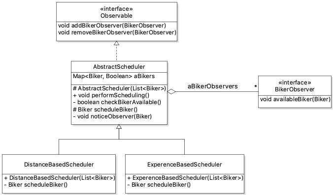
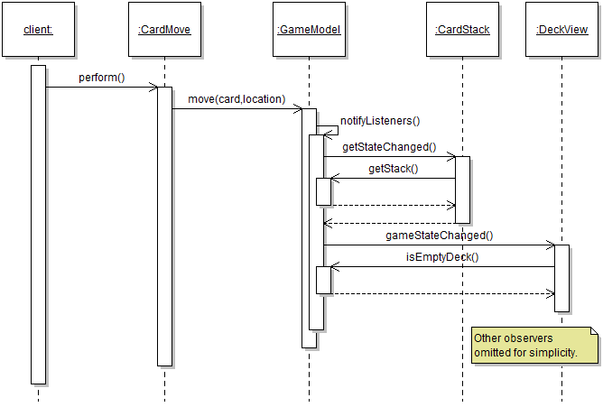

# Module 7 - Answers

Answers and answer sketches to the Module 7 practice exercises.

## Exercise 1



The UML diagram illustrates how template pattern and observer pattern are used in this design. Note that the constructor of `AbstractScheduler` is protected to prevent this class from being instantiated. The template is defined in `performScheduling` and should be fixed using final in your code.  The method `scheduleBiker` should be both `protected` and `abstract` in `AbstractScheduler`. The subclass should override `scheduleBiker` to implement step (b), i.e. the specific scheduling algorithm. In your code, you should also define the hierarchy of scheduling exceptions to make sure that the `scheduleBiker` won't throw more checked exceptions which would violate Liskov substitution principle.

## Exercise 2

The easiest solution is to copy class `TextPanel` to something like `RomanPanel` and to update the string literals from English to Roman numerals (e.g., "Two" becomes "II"). You
can leave zero as is, since the Romans were unaware of this concept (and the string for zero is not displayed anyways). To add the panel to the application, simply add this statement at the appropriate place 
in method `start`:

```java
root.add(new RomanPanel(model), 0, 3, 1, 1);
```

The point of this exercise was to demonstrate how the Observer pattern makes it very easy to add/remove views without affecting the rest of the code.

## Exercise 3

The main change is that the callback no longer has a parameter. This requires documenting how the concrete observers can access the model data. In the diagram this is represented by the aggregation to the `Model` and the parameter in the constructor, which clarifies how this aggregation is acquired. The other concrete observers are left out without loss of generality.


In the code, besides updating the signature of the callback method, the number in the model needs to be accessed from the reference to the model, for example in `IntegerPanel`:

```java
@Override
public void newNumber()
{
   aText.setText(new Integer(aModel.getNumber()).toString());
}
```

The sequence required to update the observers becomes a bit more complex:


## Exercise 4

The minimal code to exercise all parts of the pattern is shown below. The skeleton implements the last version of the design discussed in the case study.

```java
public class Inventory
{
	private List<Item> aItems = new ArrayList<>();
	private List<AdditionObserver> aAdditionObservers = new ArrayList<>();
	private List<RemovalObserver> aRemovalObservers = new ArrayList<>();
	
	public static void main(String[] args)
	{
		Inventory inventory = new Inventory();
		PieChart pieChart = new PieChart();
		ListView listView = new ListView();
		TransactionLogger logger = new TransactionLogger();
		inventory.addAdditionObserver(pieChart);
		inventory.addAdditionObserver(listView);
		inventory.addAdditionObserver(logger);
		inventory.addRemovalObserver(pieChart);
		inventory.addRemovalObserver(listView);
		
		Item item1 = new Item("Stapler");
		Item item2 = new Item("Toaster");
		inventory.addItem(item1);
		inventory.addItem(item2);
		inventory.removeItem(item1);
	}
	
	public void addAdditionObserver( AdditionObserver pObserver )
	{
		aAdditionObservers.add(pObserver);
	}
	
	public void addRemovalObserver( RemovalObserver pObserver )
	{
		aRemovalObservers.add(pObserver);
	}
	
	public void addItem(Item pItem)
	{
		aItems.add(pItem);
		notifyAdditionObservers(pItem);
	}
	
	public void removeItem(Item pItem)
	{
		aItems.remove(pItem);
		notifyRemovalObservers(pItem);
	}
	
	private void notifyAdditionObservers(Item pItem)
	{
		for( AdditionObserver observer : aAdditionObservers )
		{
			observer.itemAdded(pItem);
		}
	}
	
	private void notifyRemovalObservers(Item pItem)
	{
		for( RemovalObserver observer : aRemovalObservers )
		{
			observer.itemRemoved(pItem);
		}
	}
}

interface AdditionObserver
{
	void itemAdded(Item pItem);
}

interface RemovalObserver
{
	void itemRemoved(Item pItem);
}

class Item
{
	private String aName;
	
	public Item(String pName)
	{
		aName = pName;
	}
	
	@Override
	public String toString()
	{
		return aName;
	}
}

class PieChart implements AdditionObserver, RemovalObserver
{
	@Override
	public void itemRemoved(Item pItem)
	{
		System.out.println("Removed " + pItem + " from PieChart");		
	}

	@Override
	public void itemAdded(Item pItem)
	{
		System.out.println("Added " + pItem + " to PieChart");		
	}
}

class ListView implements AdditionObserver, RemovalObserver
{
	@Override
	public void itemRemoved(Item pItem)
	{
		System.out.println("Removed " + pItem + " from ListView");		
	}

	@Override
	public void itemAdded(Item pItem)
	{
		System.out.println("Added " + pItem + " to ListView");		
	}
}

class TransactionLogger implements AdditionObserver
{
	@Override
	public void itemAdded(Item pItem)
	{
		System.out.println("Logged addition of " + pItem) ;		
	}
}
```

## Exercise 5

The class diagram. A useful variant would be to add dependencies between concrete observers (e.g., `DeckView`) and the `GameModel`, since the callbacks mostly access the game model.


The sequence diagram starts the sequence with a "client" calling `perform` on a `CardMove` target. This happens in the GUI code. Note that the model leaves out numerous details, among others the non-trivial logic in `GameModel.move(...)`, so as to focus on illustrating the behavior relevant to the observer pattern. Many instances of `GameModelListener` are left
out to avoid cluttering the diagram.



### Exercise 6

```java
public class ShowDate extends Application
{
	 public static void main(String[] args) {
	        launch(args);
	 }
	    
	 @Override
	 public void start(Stage pPrimaryStage)
	 {
		 Label label = new Label(LocalDateTime.now().toString());
		 Button button = new Button("Press here");
		 button.setOnAction(new EventHandler<ActionEvent>() 
		 {
		     @Override
		     public void handle(ActionEvent arg0)
		     {
		    	 label.setText(LocalDateTime.now().toString());
		     }
		 });
    	
    
		 HBox hbox = new HBox();
		 hbox.setAlignment(Pos.CENTER);
		 hbox.getChildren().addAll(label, button);

		 pPrimaryStage.setScene(new Scene(hbox));
		 pPrimaryStage.show();
	 }

}
```