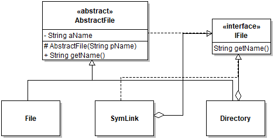

## Exercises

For maximum learning effectiveness, please check the [answers](../Answers/M8-Answers.md) only after giving the problems an honest try.

1. Add Visitor support to the class hierarchy below by completing the class diagram. Include a `PrintVisitor` as part of the design. Using a sequence diagram, show a scenario of a traversal through a directory object with the print visitor. The `PrintVisitor` prints the name of each file it visits. Implement a mock-up of the design in code, and use the debugger to validate your sequence diagram.

2. Extend the file system class hierarchy to include a `HiddenDirectory` class that is a subclass of `Directory`. For the purpose of this exercise, a hidden directory behaves just like a directory, but prints the name as `"." + getName().` Adjust both the diagrams and the code in consequence.

3. Instead of using a subclass for `HiddenDirectory`, implements this feature using the Decorator Design pattern. Adjust both the diagrams and the code in consequence.

4. Implement a `DeleteVisitor` that find a file with a name passed as parameter to the visitor, and delete all its children, if the file is a directory or a symbolic link that refers to a directory. Once this works, try changing the code so that the specified `IFile` also gets deleted. Is this a good idea?

5. Run the [University Demo](https://github.com/prmr/SoftwareDesign/tree/master/modules/artifacts/module-08). What is the order of traversal implemented in `SearchVisitor`? What happens if two committees with the same parent node have the same name? Use the debugger to confirm your answer.

6. Experiment with different traversal orders for the visitor. 

7. With the University example, implement a `CommitteeDepthVisitor` that can discover the sub-committee depth of a committee that matches an input query. For example, a root committee would have value 0, a sub-committee, 1, and a sub-sub-committee 3. 

8. Solve the [review question](https://github.com/prmr/SoftwareDesign/blob/master/modules/Module-08.md) by producing a class diagram, sequence diagrams to illustrate a command execution, and implement a mock-up of your solution.

---
Note: this content is updated from exercises in [Introduction to Software Design with Java](https://github.com/prmr/SoftwareDesign/blob/master/modules/Module-08.md) by Martin P. Robillard